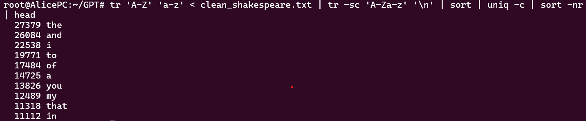
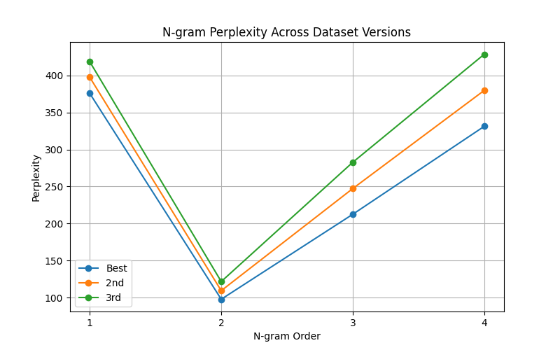
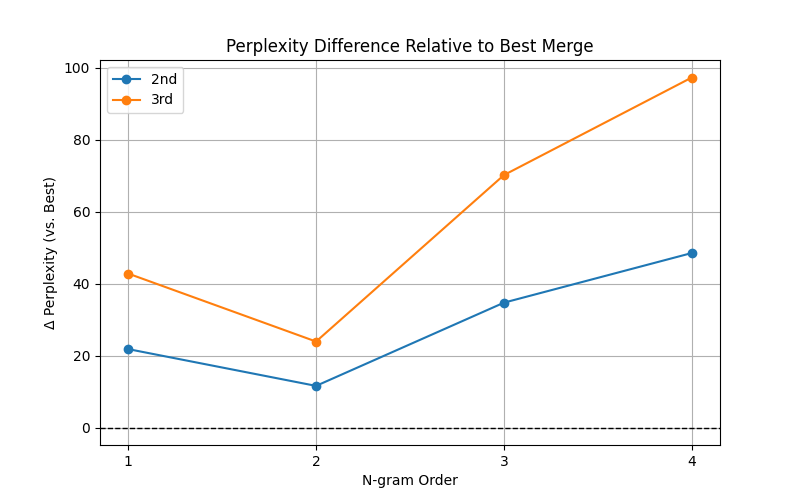
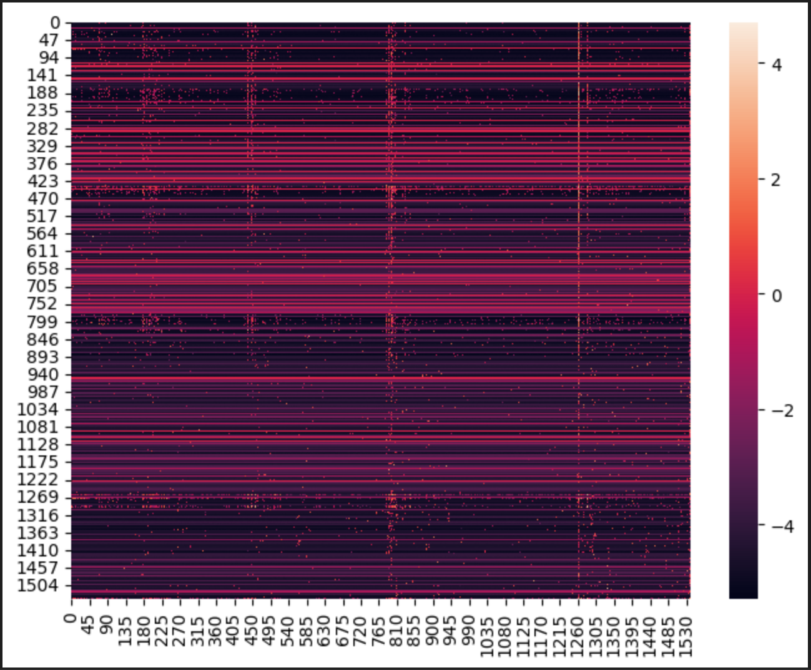

# Building GPT from Scratch: Course Report

## Milestone 0 : Simple Tokenization with Unix
In Natural Language Processing (NLP), one first step is to tokenize a given text into different tokens. These tokens then serve as a basis for the vocabulary and other processes. 
Tokenization can be more or less sophisticated. A very simple way is to just remove punctuation and use spaces as an indicator for separation of tokens. 
This can easily be achieved by using different Unix commands, as demonstrated in the following. 
```bash
tr -sc 'A-Za-z' '\n' < corpora/clean_shakespeare.txt |head
```
With this line, everything that is not an uppercase or lowercase letter (identified via `-c` meaning complement) is squeezed together (via the flag `s`) and substituted by a new line, resulting in the following output:

To sort the output by alphabet, the command can be easily extended by a `sort` pipe: 
```bash
tr -sc 'A-Za-z' '\n' < corpora/clean_shakespeare.txt |sort |head
```

To get a better overview, the pipeline below can be used to only show unique tokens with their corresponding absolute frequencies.
It is important to sort before applying `uniq`, since this command only counts consecutive lines.
````bash
tr -sc 'A-Za-z' '\n' < corpora/clean_shakespeare.txt |sort |uniq -c |head
````
Executing that line, gives you this output:


To gain a better understanding of the given corpus, the unique characters can again be sorted by occurrence, applying again a ``sort`` operation.
This time, we need to specify ``-n``, to sort numerically (by the number of occurrence) and `-r`, meaning reverse ordering, so starting with the token that occurs the most. 
````bash
tr -sc 'A-Za-z' '\n' < corpora/clean_shakespeare.txt |sort |uniq -c |sort -n -r |head
````
This pipeline results in the following output:


From this, we can identify two problems.
First, as we can see for the token "I", we still have a mixture of uppercase and lowercase letters, while we aim to have a case-insensitive tokenization.
This is easily fixed by adjusting the pipeline to merge upper- and lowercase letters.
````bash
tr 'A-Z' 'a-z' < clean_shakespeare.txt | tr -sc 'A-Za-z' '\n' | sort | uniq -c | sort -nr | head
````
Here we can see, that the problem is now solved:

Second, the last line of the head is just the character "d", resulting from the mere removal of punctuation. 
Contractions like "I'd" will lead to "d" being perceived as a single token. By that, it is showcased how primitive this way of tokenization is.
For more complex models, more sophisticated algorithms, like Byte-Pair Encoding, should be used for this step to ensure better performance.

## Milestone 1: Byte-Pair Encoding

The Byte Pair Encoding Milestone is composed of the following parts:

* getting unique characters from the corpus
* applying our BPE function 
* checking for accuracy
* comparing byte pairs from our encoding to another model's encoding
* evaluating our encoding on a different corpus

### Getting unique characters from the corpus
We retreive all unique characters from the corpus by applying our get_words function, which uses a regular expression tokenizer
that also counts the occurence of each character and saves this into a dictionary.

### Applying our BPE function
We then utilize our self written BPE function, that takes the corpus text as well as the dictionary of vocabulary 
and a certain number of k merges. The BPE function searches for the most common occurence of a token following another and then merges these tokens into a new token and appends the new token to the vocabulary. It returns the new vocabulary after k merges, a sorten token frequency and a dictionary matrix. In order to get the best three merges, we first used our accuracy function and searched for the lowest number of merges that yield an accuracy bigger than 75%, as our minimum merges, then applied the BPE function with 1minimum merges to 2001 merges in steps of 100 to our training set, created a uni-, a bi- a tri- and a fourgram for each k and evaluated their perplexity, then saved the k and the kind of n-gram for the top three best perplexities. Furthermore we used those top three best merges to split our training, validation and test corpus into byte pairs using our to_byte_pair function that applies the vocabulary retrieved from the BPE function and splits the corpus accordingly. 

The results we obtained are visualized in the following plot:


### Checking for Accuracy
Now, we evaluate the accuracy, by calculating for each of the given top three k, how many percent of the 500 most frequent words in the corpora are part of the vocabulary. Checking for both training and testing set and then reporting accuracy.


This image also shows the accuracy for all ks from 1 to 2001, that we used to find the minimum merges that yield an accuracy >75%.


### Comparing our encoding to another's model encoding
Another evaluation measure we implemented is to compare how much the words generated by our BPE encoding overlap with the encoding of another model. For this we used GPT 3.5 turbo to once again produce byte pairs and compute the overlap. We did this on both our training and test set for all top three best merges


### Evaluating our encoding on a different corpus
As a last measure of evaluation, we used a different corpus: scripts from the tV show 'Friends' and compared how many of the 500 most frequent words from our friends corpus were part of the byte pair vocabulary. We computed accuracy for the top three best merges. Morevover we once again compared our byte pair encoding with the encoding of GPT 3.5 turbo using our friends corpus


## Milestone 2: A Simple N-Gram

The Simple N-Gram is composed of the following parts:

* n-gram engine, incl.
  * Laplace smoothing
  * backoff
* extrinsic evaluation

### N-gram engine
To initialise an n-gram, we pass the corpus it is to be based on, the dimension n, and the vocabulary size. During initialisation, we first calculate the Unigram probabilities given the byte-pair tokenised corpus, adding Laplace smoothing. Depending on the dimension, n, that corpus is then divided into chunks of size n. Using nested dictionaries, the n-gram probabilities are now calculated from that chunked corpus. 

Additionally, the n-gram object also contains a function to calculate the perplexity (also including backoff, as that is also used in generation). Perplexity is calculated in logspace, according to:

* add formula

If a token has not been seen at any order, not even unigram, we assign a small probability of $1e-8$.

To intrinsically evaluate the n-grams we use the k best merges produced in Milestone 1, and calculate perplexity for each of the n-grams on the test set.

| Merge | Unigram | Bigram | Trigram | 4-gram |
|------|------|------|------|----------|
| Best   | 373.932 | 111.872 | 366.948 | 501.771     |
| 2nd   | 394.808 | 125.166 | 414.621 | 543.982     |
| 3rd  | 415.713 | 140.449 | 465.555 | 591.304     |





As we can see, the Bigram always performs best. Usually it is followed by the Trigram, but sometimes also the Unigram. The 4-gram always has the worst performance. This is likely caused by the rather small corpus and the hard backoff.

For extrinsic evaluation, we use a generator, again using backoff, that is provided with a short prompt. The input is tokenised, and the following text is generated token by token.

|           | Unigram                                                                                                                                                                                                                                                                                                                                                                                                                                                                                                                                                                                                                                                                                      | Bigram                                                                                                                                                          | Trigram                                                                                                                         | 4-gram                                                                                                                                                                                                                                                                                                                                                                         |
|:----------|:---------------------------------------------------------------------------------------------------------------------------------------------------------------------------------------------------------------------------------------------------------------------------------------------------------------------------------------------------------------------------------------------------------------------------------------------------------------------------------------------------------------------------------------------------------------------------------------------------------------------------------------------------------------------------------------------|:----------------------------------------------------------------------------------------------------------------------------------------------------------------|:--------------------------------------------------------------------------------------------------------------------------------|:-------------------------------------------------------------------------------------------------------------------------------------------------------------------------------------------------------------------------------------------------------------------------------------------------------------------------------------------------------------------------------|
| Best | cleopatra is my iturwhat ppxi'll ies knoneethem hihere whconpixwn ous ry fayet hath perdeblservter up minhis de 'et than now resk be brutus duwafli'll some de , hbut ynikio moreader thoumay ing stonshall bfirst an our l urmpus e thus let tell whiwaelus give thoudualwarnis opbeawhat soeeorbut lowere seeewhiothello macbeth what ll may swmake e grason leappt's venonhere schave gimemlord unana swno dahansotake out more wameter!                                                                                                                                                                                                                                                  | cleopatra is my sourtues mark that shall tellutive now seek natural ;                                                                                           | cleopatra is my buttons be dismiles and caelihoods are, my countenant, coming to what is't, here will rest defence robin gold . | cleopatra is my stiterstigive hondenbrutus t sihere le ed inmed adour!                                                                                                                                                                                                                                                                                                         |
| 2nd | cleopatra is my helquiyour some doth ,do goous enl abtiam this eyck ourof resder me ginever comenter ks ?                                                                                                                                                                                                                                                                                                                                                                                                                                                                                                                                                                                    | cleopatra is my head upon to w'st up fruled betned unharshuty catle criest women o blos whom petteroutrace must knowoof his face by thy bloody traithyme undo ! | cleopatra is my mothern that day appeared vial, that he can report, like the hymn black, quite .                                | cleopatra is my w kidys weo ks ws lady aclike oomy commhis es mbmen desydoth mark harand with ghse ness waleaknow ys well there simonciromeo then haparwarafdesconso bede my lmost supon be lltwnot d grahanss caesar verin hearson your juenter am ys th bui'll gump sull helss upon ts g spgo thouadnever oulook may great ess naenter drtime t pathere here ch bahe cmark ; |
| 3rd | cleopatra is my such there she alexeunt hohureseed desdemona up erlord most tint'd parke warfatake nerhis elfidall venchadeafirst my exit , swhe remaft er inselcermacbeth oacreswichabanveen ce logive ghblprishould tenas first have look are ry wany men pleaderbe om bll colness had my wrneforts very suoctavius dryet doth shiiago lthedising a con'd heasuch so ourshould al what beter yn ear' sh tch was eldisbge itloupon very had 'ter et ilexit ble ilwere atobof lord ght we wheagahave rime felgreat first see gin theopbefore an of platobeais beaexshe y dobe any octavius flonourusealcoleach shafaicassius d warhis him tenmay never ' bige muwhich gochict portia not sea | cleopatra is my expressed in rome are out mony crosses out ond in peterrietches which giance the ple her but keep deddkey-horseverynaughs cresty alter ;        | cleopatra is my hand .                                                                                                          | cleopatra is my ' :                                                                                                                                                                                                                                                                                                                                                            |

As we can see, the Bigram and Trigram usually perform relatively well. As we have seen in more extensive tests, we usually get coherent output. Unfortunately, for the Unigram and the 4-gram we often back off to n=1. As that then samples from the unigram distribution, the output is often random and, for lack of a stoptoken, often rather long.

## Milestone 3: The Neural N-Gram

The Neural N-Gram is composed of the following parts: 

* embedding
* forward pass
* backward pass
* optimizer
* generate function

In training a step through the network functions as follows: 

First the training function is called which is passed the number of training steps, as well as after how many steps the training progress should be evaluated. For every step we sample a batch of inputs and targets from the tokenized training version of the shakespeare corpus. With these the forward step is called

#### The forward pass
The goal of the forward pass within training is to quantify the current performance of the embedding. Within the neuronal network, the embedding are the weights (of size vocab_size x vocab_size). From a higher-level perspective however, the embedding is a bigram word-co-occurance matrix that is modified based on the input examples in training. For this, the input is first reshaped into logits, changing their shape from batch, seq_len to batch, seq_len, vocab_size. Then we calculate and return both the logits and the softmaxed cross-entropy loss between the input and the target. 

#### The backward pass
Now that we have quantified the performance we have to modify the weights accordingly. For this we have to calculate the gradient. Luckly for us the gradient through the softmaxed crossentropy is just the softmaxed input minus the one-hot encoding of the targets. To then apply the errorsignal only to the relevant weights we matrix mutliply them with the transposed one-hot-encoding of the original input. 

 #### The optimizer
For the optimizer we use the the torch version of Adam, which is passed the gradients we calculated in the backward step. For this to work, we had to convert the embedding table into a torch tensor.

#### The training
To improve the efficiency of the training we added some additional steps: 

#### Early stopping
Early stopping is a common practice to prevent overfitting and make sure the model is continuously improving during the training process. For this, when building the corpus we spit it into two parts the training corpus 90% an the validation corpus 10%. During the training we collect the loss. Aver a predetermined number of steps (validation_steps) we average the loss on the training set and compare it to how the performance of the model on 1/10*validation_step iterations on the validation set. If the performance decreases on patience iterations of the validation dataset the training is terminated. 

#### Saving the model
As the model-parameters are contained within the embedding matrix the model can be easily saved and reloaded. We automated this as follows: Whenever the file n_grams contains less than k (k=5) entries or if the performance of the current model is better than the worst performing model in the folder, the weights are saved.

#### Generation
The saved embeddings can then in turn be loaded and used to generate text. For this, a starting character and the desired text-length is passed to the generate function of the model. Tbe function then iteratively retrieves the embedding for the current token in the sequence and using a multinomial function samples the following word from it. As the tokes are index numbers at this stakes they are run through a decoding function to convert them into strings. 

#### Parameter
There are a decent number of parameters and hyperparameters involved in the model, namely: 
* training_steps (how long the model should be trained) - modified implicitly by the early stopping
* validation_steps (after how many steps the performance of the model should be checked)

| steps| loss | val_loss |
|-----|-------|----------|
| 100 | 4.07  |  5.64  |
| 250 | 4.04  |  6.35  |
| 500 | 4.09  |  5.51  |

* patience (after how many checks with no improvement the training should be canceled)

| pat| loss | val_loss |
|---|---|---|
| 2 | 4.14  |  5.39  |
| 5 | 4.07  |  5.58  |

* block_size (how many sequences are passed in each pass)

| size| loss | val_loss |
|---|---|---|
| 8  | 4.06   |  5.69  |
| 12 | 4.07   |  5.59  |
| 32 | 4.08   |  5.42  |

* seq_size (how long the sequences are)

| size | loss | val_loss |
|------|------|----------|
| 32   | 4.05 | 6.13     |
| 64   | 4.08 | 5.51     |
| 128  | 4.06 | 5.54     |

As we can see here, non of the parameters have a huge influence on the training result. Based on this limited testing, we settled on: 
sequ_size = 64, block_size = 12, steps = 100, patience = 2

* training loss, validation loss - the performance of the model on the training / validation set 
The loss of the model looks like expected, although it stagnates rather early which might be connected to the rather limited training corpus: 


This observation is also mirrored in the embedding which changes from noise to patterns over the training intervals:
<p float="middle">
  
   
  
</p>


* perplexity: As already mentioned in the previous n-gram, perplexity is a common tool to establish the performance of a language model. For our neural n-gram we have a perplexity of around 70, with our best model at 68.91. If instead of using the validation performance as a stoping criteria, we use the perplexity, we end up with a longer training, but a final perplexity of only 67.70. This suggests a strong link between the validation performance and the perplexity

 #### Output
 Examples for outputs: 
 "cleopatra , good brutus get ; bid  desdemona i will , , nor can he would aim of hadst cassius is it him tame , run on , unto his jewelling her he cannot find"

"fire . exit thee : i urp's than any ? will get clear : if locks in destiness , ft of your prince ."

"i have two ers , and most noble master ; but undged faith , whose love ? why thou counow , my compulgibesin death . . a tinent . venice , thou knee"


## Milestone 4: A Simple GPT Model
The last model we present is a simpler version of a GPT. For this model, we utilize again our predefined Byte-Pair Encoding,
to ensure better comparability to the N-Gram and the Neural N-Gram. 
In the following, we introduce some new concepts, namely Causal Self-Attention and Decoder Blocks.
Then, we describe how the different building blocks come together in the GPT model and finally explain the training process and its results.

#### Causal Self-Attention

We used a standard architecture for implementing the Causal Self-Attention class.
A linear layer is created with the dimensions: number of embeddings x 3* number of embeddings that is then split into key quaries and values as well as into different attention heads. Applying the scaled key-query dot product, we then create a causal mask to prevent GPT to access token that are supposed to be predicted while at the same time allowing our model to access previous tokens. We achieved this by setting  the weights of all "future" tokens. 
Furthermore we apply softmax to normalize our weights before using our attention dropout.
The masked attentions weights are then matrix multiplied with our values, yielding our output, that is then reshapd back to the right shape and a residual dropout is applied.
The Causal Self-Attention class returns a linear output layer containing our attention weights * values, normalized by our residual dropout.


#### The Decoder Block

Our implementation follows the classic architecture of transformer decoder blocks.
Thus, two normalization layers are employed, the first is applied directly before feeding the input through the Causal Self-Attention layer while passing the different dropout rates (residual dropout and attention dropout).
To prevent vanishing gradients, the original input is added to that result forming the first residual connection.
The result is then forwarded to the second normalization layer and then through a basic MLP with two linear layers, with GeLU as activation function. GeLU addresses again the vanishing gradients problem which often occurs in GPT models.
Here, we employ dropout again for better generalization. Last, we add another residual connection. 
In total, this results in the following architecture:

* $x = input$
* $x' = Layer Normalization (x)$
* $x' = CausalSelfAttention(x')$
* $x = x' + x$

MLP:
* $x' = Linear(x)$ with $input\_dimension = embedding\_size$, $output\_dimension = 4* embedding\_size$
* $x' = Linear2(x')$ with $input\_dimension = 4*embedding\_size$, $output\_dimension = embedding\_size$
* $x' = Dropout(x')$
* $x = x' + x$
#### The GPT model

#### Training

In training, we go through several `trainsteps`. In each trainstep, we use the given vocabulary to generate two batches of the shape $(batch\_size, chunk\_size)$.
One is the input batch, that is fed through the GPT model, the other is the target batch. The target batch contains the same sequence as the input batch, only shifted by one, so having the token that directly follows the input token at the same index.
The input batch is then used to generate the model's output, which is then compared to the target sequence. We use `Categorical Cross entropy` to calculate the resulting loss. This error signal is then propagated through the network via the `AdamW` optimizer.
The optimizer uses different learning rates for each parameter and is therefore particularly suited for this task. 
For extrinsic evaluation, we the generate a text with the trained model to calculate its perplexity. The text is also decoded for subjective evaluation.

#### Hyperparameter Search
### Gridsearch
We performed a small Gridserach over the following parameters to optimze the model over 3 epochs a 1200 steps : 
* number of layers: [4, 8]
* number of heads: [2, 4]
* embedding size: [128, 256]
* learning rate: [1e-3, 1e-4]
* batch size: [16, 32]
For this the optimal values turned out to be layers: 4, heads: 2, embedding: 256, learning rate: 0.001, batch_size: 16 with a perlexitity on the valaidation data of  162.04.
To ensure the loss model is optimzized we then train it for 10 epochs with 1000 steps each, which leads to the following loss curve: 


As is apparent in the image while the training loss is steadily decreasing, we reach a point of overfitting quite early. This might be the case because splitting the corpus simply means the training data contains differnt works than the validation data, which might contain some inherently unique strucutres. Additionally, simplifications made to the gpt model such simpler weight initialization and optimizer configuration. 

### Further exploration
Based on the parameter combination defined by the grid search we explored some parameters futher.

## Size of the embedding
The size of the neural embedding is the basis of the model, and has a strong ifluencen on the model size and runtime. As expected there is a strong correlation between the embedding size and the perplexity performance. However, there is a limit to this, at around 512. 


The text generated by the model with the best embedding size has some notable features. For one, it has a solid use of punctuation with a strange focus on questionmarks. It also contains the dialoge-esque structure common in the more complext modes, with a high frequency of names and a conversation tone.: 

" cleopatra is he ? or did you it ? mark antony and that you so ? mark antony is he not so ? as it is , sir . octavius caesar let him : he shall in time . mark antony : he was itious in the end . mark antony the le and the ? mark antony the queen ? mark antony and all his face ? second in his death , and he has a laert: his was as he would not have him . exeunt all but antony "


#### Output
"other men . brutus what , i am not well ; i have no more than to be at the t to do . brutus i have done no . cassius what , my lord ? brutus , i would not know you know that you do . brutus i know you not , and i am to speak of you ;"

"cleopatra , if you to the e-house . exit charmian no , nor i in love with you  cleopatra and , sir , . cleopatra you have done , me ; and i will not be ."

"last , i pray thee ; for i have seen the last night of the world . desdemona i you , my lord , my lord , i am for this . othello i am to have done any man in my life ; and , for my soul ;"

## Comparison
#### Perplexity
To compare the performance across the different models we compare the perplexity on the test dataset.
|model       | train   | validation | test |
|------      |------   |------  |----------|
| GPT        | 44.08   | 177.14 | 179.71   |
|neural-ngram| 61.74   | 151.90 | 150.24   |  
| bi-gram    | 97.83   | 112.09 | 111.87   |


Interestingly, while the performance on the train dataset consistently improves on the more complicated models, the perplexity on the validation and test dataset decreases. This is probably in part due to the rather small corpus. 

#### Dropout
Dropout is a common method to add normailzation to the model and prevent overfitting. Since we have a notable overfitting issue with out model it makes sense to test out whether higher droupout rates imporve the performance. The model contains 4 dropout parameters: 
* embd_pdrop: dropout for the embedding layer
* resid_pdrop: dropout probability for the residual connections
* attn_pdrop: dropout probability for the attention weights
* dropout: global dropout probability
Increasing the global dropout probabiltiy has no notable effects on the performance 
<p float="center">
  
   
</p>
However, while it seemingly does improve the overfitting issue, most of the effect is only due to a higher overall loss. This is also reflected in the perplexity, which does not get lower than then 160 mark set by out baseline model. 

<p float="center">
  <br>
  <em>Embedding Dropout Perplexity</em>
</p>
<p float="center">
  <br>
  <em>Attention Dropout Perplexity</em>
</p>
<p float="center">
  <br>
  <em>Residual Dropout Perplexity</em>
</p>


#### Qualitative comparison
Best Bigram

"cleopatra is my sourtues mark that shall tellutive now seek natural ;"


Neural n-gram:

"cleopatra , good brutus get ; bid  desdemona i will , , nor can he would aim of hadst cassius is it him tame , run on , unto his jewelling her he cannot find"

GPT: 

"cleopatra , if you to the e-house . exit charmian no , nor i in love with you  cleopatra and , sir , . cleopatra you have done , me ; and i will not be ."

While none of the models produces sound texts, the texts are strucutrally different. While new-line characters are lost in the preprocessing, in the more complex models the dialog strucutre of shakespears dramas is noticable and explains the frequency of names mentioned. GPT additionally contains apects of the spekers reffering to each other (frequent pronous like "you", "me"; honorifics like "sir" ).