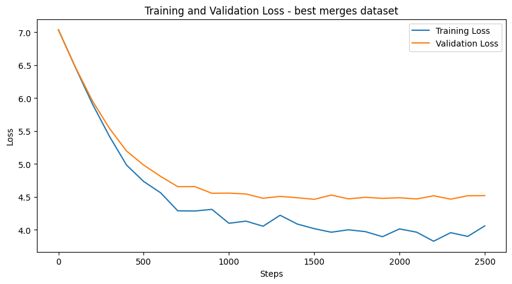
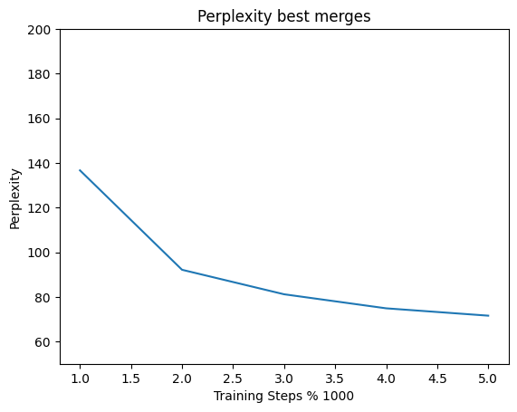
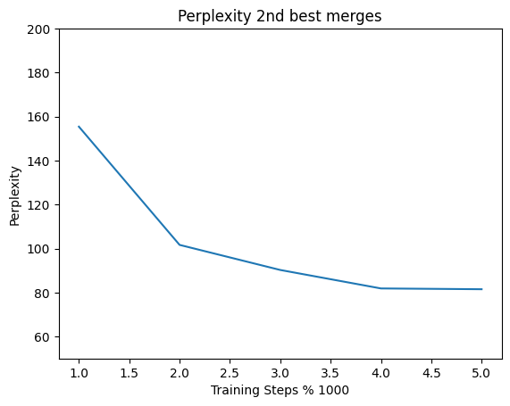
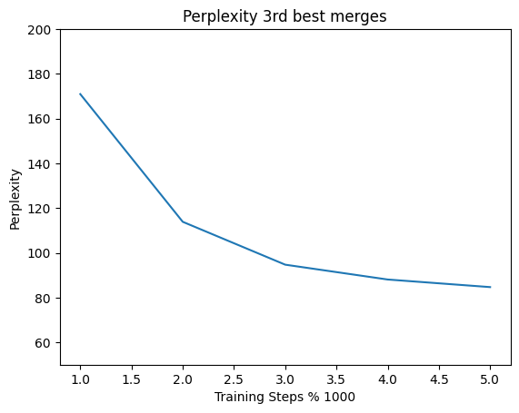

# Building GPT from Scratch: Course Report

## Milestone 0 : Simple Tokenization with Unix
In Natural Language Processing (NLP), one first step is to tokenize a given text into tokens. These tokens then serve as a basis for the vocabulary and later processes. 
Tokenization can be more or less sophisticated. A very simple way is to just remove punctuation and use spaces as an indicator for separation of tokens. 
This can easily be achieved by using different Unix commands, as demonstrated in the following. 
```bash
tr -sc 'A-Za-z' '\n' < corpora/clean_shakespeare.txt |head
```
With this line, everything that is not an uppercase or lowercase letter (identified via `-c`, meaning complement) is squeezed together (via the flag `s`) and substituted by a new line, resulting in the following output:

To sort the output by alphabet, the command can be easily extended by a `sort` pipe: 
```bash
tr -sc 'A-Za-z' '\n' < corpora/clean_shakespeare.txt |sort |head
```

To get a better overview, the pipeline below can be used to only show unique tokens with their corresponding absolute frequencies.
It is important to sort before applying `uniq`, since this command only counts consecutive lines.
````bash
tr -sc 'A-Za-z' '\n' < corpora/clean_shakespeare.txt |sort |uniq -c |head
````
Executing that line, gives you this output:


To gain a better understanding of the given corpus, the unique characters can again be sorted by occurrence, again applying a ``sort`` operation.
This time, we need to specify ``-n``, to sort numerically (by the number of occurrence) and `-r`, meaning reverse ordering, so starting with the token that occurs the most. 
````bash
tr -sc 'A-Za-z' '\n' < corpora/clean_shakespeare.txt |sort |uniq -c |sort -n -r |head
````
This pipeline results in the following output:


From this, we can identify two problems.
First, as we can see for the token "I", we still have a mixture of uppercase and lowercase letters, although we aim to have a case-insensitive tokenization.
This is easily fixed by adjusting the pipeline to merge upper- and lowercase letters.
````bash
tr 'A-Z' 'a-z' < clean_shakespeare.txt | tr -sc 'A-Za-z' '\n' | sort | uniq -c | sort -nr | head
````
Here we can see, that the problem is now solved:

Second, the last line of the head is just the character "d", resulting from the mere removal of punctuation. 
Contractions like "I'd" will lead to "d" being perceived as a single token. By that, it is showcased how primitive this way of tokenization is.
For more complex models more sophisticated algorithms, like Byte-Pair Encoding, should be used for this step to ensure better performance.

## Milestone 1: Byte-Pair Encoding

The Byte Pair Encoding Milestone is composed of the following parts:

* getting unique characters from the corpus
* applying our BPE function with varying `k`
* checking for accuracy
* comparing byte pairs from our encoding to another model's encoding
* evaluating our encoding on a different corpus

### Getting unique characters from the corpus
We retrieve all unique characters from the corpus by applying our ``get_words()`` function, which uses a regular expression tokenizer that also counts the occurence of each character and saves this into a dictionary.

### Applying our BPE function
We then utilize our self-written BPE function ``bpe()``, that takes a dictionary with the tokens mapped to their respecitve occurence counts, and a certain amount of merges `k` as input. The BPE function searches for the most common occurence of a token following another. These tokens are then merged into one new token, which is appended to the vocabulary. After `k` merges, it returns the new vocabulary, a sorted token frequency and a dictionary matrix. In order to determine the best three `k` merges, we first use our accuracy function ``performance()``, which calculates the percentage of overlap between the $500$ most frequent words in the corpus and the newly merged vocabulary. We search for the lowest number of merges that yield an accuracy bigger than 75%, and consider this the minimum number of merges -- here: $k = 1101$, with an accuracy of 83%. We then apply the BPE function from that minimum number of merges to 2001 maximum merges in steps of 100 to our training set. For each `k`, we create a Uni-, a Bi- a Tri- and a 4-gram, and evaluate their perplexity. For the top three perplexities, we then save the k, and the optimal order of n-gram. We then use the top three best merges to split our training, validation and test corpus into byte pairs. To do this, we use our ``to_byte_pair()`` function that takes the vocabulary retrieved from the BPE function and applies it to split the input string, here the entire cleaned corpus, accordingly. 

The detailed results we obtained are visualized in the following plot:


### Checking for Accuracy
Now, we evaluate the accuracy. For each of the given top three `k`, we calculate how many percent of the 500 most frequent words in the corpora are part of the vocabulary, for both training and test set.


This image also shows the accuracy for all ks from 1 to 2001. As mentioned, we consider the minimum number of merges to require an accuracy >75%.


### Comparing our encoding to another model's encoding
Another evaluation measure we implemented is to compare how much the words generated by our BPE encoding overlap with the encoding of another model. For this we used ``GPT 3.5 Turbo`` to once again produce byte pairs and compute the overlap. We did this on both our training and test set for all top three best merges.


### Evaluating our encoding on a different corpus
As a last measure of evaluation, we used a different corpus: scripts from the TV show 'Friends'. We then compared how many of the 500 most frequent words from our 'Friends' corpus were part of the byte pair vocabulary. We computed accuracy for the top three best merges. Morevover, we once again compared our byte pair encoding with the encoding of ``GPT 3.5 Turbo``.


## Milestone 2: A Simple N-Gram

The Simple N-Gram is composed of the following parts:

* N-gram engine, incl.
  * Laplace smoothing
  * Backoff
* Extrinsic evaluation

### N-gram engine
To initialise an n-gram, we pass the training corpus it is going to be based on, the order `n`, and the vocabulary size. During initialisation we first calculate the Unigram probabilities given the byte-pair tokenised corpus, adding Laplace smoothing, with our ``get_unigram_probs()``. Depending on the order of the n-gram `n`, that training corpus is then divided into chunks of size `n` with ``split_ngrams()``. Using nested dictionaries, the n-gram probabilities are now calculated from that chunked corpus with ``calculate_n_gram_probs()``. 

Additionally, the n-gram object also contains a generation function ``generate()``, and one to calculate the perplexity ``perplexity()``. Both also rely on the backoff function ``backoff_prob()``. Our ``perplexity()`` function calculates the perplexity in logspace, according to:

$$PP = \exp\{-\tfrac{1}{M} \sum_i \log P(w_i \mid \text{context}_i)\}$$

In our backoff-function, we recursively back off from the full n-gram context down to the unigram if a token is unseen in the given context. If a token has not been seen at any order, not even unigram, we assign a small probability of $1e-8$.

To intrinsically evaluate the n-grams we use the k best merges produced in Milestone 1, and calculate perplexity for each of the n-grams on the test set.

| Merge | Unigram | Bigram | Trigram | 4-gram |
|------|------|------|------|----------|
| Best   | 373.93 | 113.94 | 271.78 | 374.79     |
| 2nd   | 394.81 | 127.68 | 311.53 | 425.08     |
| 3rd  | 415.71 | 143.20 | 354.39 | 478.51     |


As we can see, the Bigram always performs best, the Trigram second best, then the Unigram. The 4-gram always has the worst performance. In general, the perplexity is rather high. This might happen for a number of reason. Especially the n-grams of a higher order may be overfitting to the rather small corpus, for example, or the smoothing may be too simplistic. We also implemented a hard backoff, and did not include a designated unknown character during training, which may affect perplexity.


For extrinsic evaluation, we use our ``generate()`` function with backoff. We provide it with a short prompt, "cleopatra is my", that is then tokenised. The following output is generated token by token. To generate the following text, we used top_k with $k=3$.

| Rank | Unigram                                                                                                                        | Bigram                                              | Trigram                                                  | 4-gram                                                                                                                                                         |
|:-----|:-------------------------------------------------------------------------------------------------------------------------------|:----------------------------------------------------|:---------------------------------------------------------|:---------------------------------------------------------------------------------------------------------------------------------------------------------------|
| Best | cleopatra is my , , and the , , , the , , and , , and and , and .                                                              | cleopatra is my lord polonius i do not .            | cleopatra is my daggers, and all things shall be .       | cleopatra is my dagvalour of my evance validityvalued to vy and provoking tere's the sky and vanishes whvaliant is vanik, where savvy to thy knieces vain, the train, with purpose . |
| 2nd  | cleopatra is my , .                                                                                                            | cleopatra is my lord ;                              | cleopatra is my buvalour, and i will not be aways, and that is not so . | cleopatra is my butt, and knaviv .                                                                                                                              |
| 3rd  | cleopatra is my , and , .                                                                                                      | cleopatra is my lord polonius 'er, i will i am not a man : | cleopatra is my lord .                                    | cleopatra is my name ;                                                                                                                                         |


As we can see, the Bigram and Trigram usually perform relatively well. As we have seen in more extensive tests, we usually get coherent output. As expected, the Unigram samples randomly from the four most used tokens. The rather poor output of the 4-gram is also expected, as it is very likely overfitting to peculiaries of the rather small corpus. 


## Milestone 3: The Neural N-Gram

The Neural N-Gram is composed of the following parts: 

* embedding
* forward pass
* backward pass
* optimizer
* generate function

A single training step through the network functions goes as follows: 

First the training function ``train()`` is called which is passed the number of training steps, as well as after how many steps the training progress should be evaluated. For every step, we sample a batch of inputs and targets from the tokenized version of the Shakespeare training corpus. On these, the forward step ``forward()`` is called.

#### The forward pass
The goal of the forward pass within training is to quantify the current performance of the embedding. Within the neuronal network, the embedding are the weights (of size `vocab_size x vocab_size`). From a higher-level perspective however, the embedding is a Bigram word-co-occurence matrix that is modified based on the input examples in training. For this, the input is first reshaped into logits, changing their shape from `batch, seq_len` to `batch, seq_len, vocab_size`. Then, we calculate and return both the logits and the softmaxed cross-entropy loss between the input and the target. 

#### The backward pass
Now that we have quantified the performance, we call ``backward()`` to modify the weights accordingly. To do this, we first have to calculate the gradient. The gradient through the softmaxed crossentropy is just the softmaxed input minus the one-hot encoding of the targets. To then apply the error-signal $\delta$ only to the relevant weights, we perform a matrix-multiplication of the error signal $\delta$  with the transposed one-hot-encoding of the original input. 

 #### The optimizer
For the optimizer we use the the PyTorch implementation of Adam. To pass the gradients we calculated in the backward step, we have to convert the embedding table into a torch tensor.

#### The training
To improve the efficiency of the training we added some additional steps: 

#### Early stopping
Early stopping is a common practice to prevent overfitting and make sure the model is continuously improving during the training process. For this, we use both the training and the validation corpus provided. During training we record the loss. Then, after a predetermined number of steps `validation_steps`, we average the loss on the training set and compare it to the model's performance on $`1/10 \cdot validation\_step`$ iterations on the validation set. If the performance decreases on a set amount of iterations of the validation dataset `patience`, the training is terminated. 

#### Saving the model
As the model-parameters are contained within the embedding matrix the model can be easily saved and reloaded. We automated this as follows: Whenever the file n_grams contains less than `k` (k=5) entries, or if the performance of the current model is better than the worst-performing model in the folder, the weights are saved.

#### Generation
The saved embeddings can then in turn be loaded and used to generate text. For this, a starting character `idx` and the desired text-length `max_new_tokens` is passed to the generate function of the model. The function then iteratively retrieves the embedding for the current token in the sequence and, using a multinomial function, samples the following word from it. As the tokens are index numbers at this stage, we pass them to a decoding function ``decode_characters()`` to convert them into strings. 

#### Parameter
There are a decent number of parameters and hyperparameters involved in the model, namely: 
* `training_steps` (how long the model should be trained) - modified implicitly by the early stopping
* `validation_steps` (after how many steps the performance of the model should be checked)

| steps| loss | val_loss |
|-----|-------|----------|
| 100 | 4.07  |  5.64  |
| 250 | 4.04  |  6.35  |
| 500 | 4.09  |  5.51  |

* `patience` (after how many checks with no improvement the training should be cancelled)

| pat| loss | val_loss |
|---|---|---|
| 2 | 4.14  |  5.39  |
| 5 | 4.07  |  5.58  |

* `block_size` (how many sequences are passed in each pass)

| size| loss | val_loss |
|---|---|---|
| 8  | 4.06   |  5.69  |
| 12 | 4.07   |  5.59  |
| 32 | 4.08   |  5.42  |

* `seq_size` (how long the sequences are)

| size | loss | val_loss |
|------|------|----------|
| 32   | 4.05 | 6.13     |
| 64   | 4.08 | 5.51     |
| 128  | 4.06 | 5.54     |

As we can see here, non of the parameters have a huge influence on the training result. Based on this limited testing, we settled on: 
`seq_size` = 64, `block_size` = 12, `steps` = 100, `patience` = 2

* `training loss`, `validation loss` - the performance of the model on the training / validation set 
The loss of the model looks as expected, although it stagnates rather early. This may be a result of the rather limited training corpus. 


This observation is also mirrored in the embedding, which changes from noise to patterns over the training intervals:
<p float="middle">
  
   
  
</p>


* `perplexity`: As already mentioned in the previous n-gram, perplexity is a common tool to establish the performance of a language model. For our neural n-gram we have a perplexity of around 70, with our best model at 68.91. If instead of using the validation performance as a stopping criteria, we use the perplexity, we end up with a longer training, but a final perplexity of only 67.70. This suggests a strong link between the validation performance and the perplexity

* `improved merges dataset`: For the baseline in both the neural n-gram and the GPT model we used an old dataset which was not optimized to properly capture the difference of out best_merges dataset. For the neural-n-gram, the best-merges dataset does not improve the perplexity, finishing training at a perplexity on the test dataset of 92. This is interesting as both the loss and the visualization of the model embedding look better than for out baseline dataset. 
<p float="middle">
  
   
</p>

 #### Output
 Examples of outputs: 
 "cleopatra , good brutus get ; bid  desdemona i will , , nor can he would aim of hadst cassius is it him tame , run on , unto his jewelling her he cannot find"

"fire . exit thee : i urp's than any ? will get clear : if locks in destiness , ft of your prince ."

"i have two ers , and most noble master ; but undged faith , whose love ? why thou counow , my compulgibesin death . . a tinent . venice , thou knee"


## Milestone 4: A Simple GPT Model
The last model we present is a simpler version of a GPT. For this model, we again utilize our predefined Byte-Pair Encoding to ensure better comparability to the N-Gram and the Neural N-Gram. 
In the following, we introduce some new concepts, namely Causal Self-Attention and Decoder Blocks.
Then, we describe how the different building blocks come together in the GPT model and finally explain the training process and its results.

#### Causal Self-Attention

We used a standard architecture for implementing the Causal Self-Attention class.
A linear layer is created with the dimensions: number of embeddings `n_embd` $\times 3 \cdot$ `n_embd` that is then split into key queries and values, as well as into different attention heads. Applying the scaled key-query dot product, we then create a causal mask to prevent the GPT from accessing tokens that are supposed to be predicted, while at the same time allowing our model to access previous tokens. We achieve this by setting the weights of all "future" tokens. 
Furthermore we apply softmax to normalize our weights before using our attention dropout.
The masked attention weights are then matrix-multiplied with our values. The output is then reshapd back to the right shape and a residual dropout is applied.
The Causal Self-Attention class returns a linear output layer containing our attention weights * values, normalized by our residual dropout.


#### The Decoder Block

Our implementation follows the classic architecture of transformer decoder blocks.
Thus, two normalization layers are employed. The first is applied directly before feeding the input through the Causal Self-Attention layer while passing the different dropout rates (residual dropout and attention dropout).
To prevent vanishing gradients, the original input is added to that result forming the first residual connection.
The result is then forwarded to the second normalization layer and then passed through a basic MLP with two linear layers, with GeLU as activation function. GeLU once again addresses the vanishing gradients problem that often occurs in GPT models.
Here, we employ dropout again for better generalization. Lastly, we add another residual connection. 
In total, this results in the following architecture:

* $x = input$
* $x' = Layer Normalization (x)$
* $x' = CausalSelfAttention(x')$
* $x = x' + x$

MLP:
* $x' = Linear(x)$ with $input\_dimension = embedding\_size$, $output\_dimension = 4* embedding\_size$
* $x' = Linear2(x')$ with $input\_dimension = 4*embedding\_size$, $output\_dimension = embedding\_size$
* $x' = Dropout(x')$
* $x = x' + x$
* 
#### The GPT model

Our implementation is a considerably simplified version of the full-size GPT models. The main architecture is classical. During initalisation ``__init__`` we first build the transformer layers, starting with an embedding layer for the word tokens and for the positional encoding, then adding a drpopout layer for the embeddings. We then add a set amount of decoder blocks, determined by `n_layer`, and a layer normalisation layer. Lastly, we add a linear layer as the head. Instead of a complex weight and optimiser initialisation scheme, we simply initialise both automatically. Our GPT model class has the following functions:

* ``count_params()``, which returns the number of parameters, excluding the head
* ``configure_optimizer()``, which, as mentioned above, simply calls the default PyTorch implementation of the `AdamW` optimiser on our parameters
* ``transformer_forward()``, which is just the forward pass through the transformer layers and is called during our general forward pass
* ``forward()``, which is the forward pass through the whole model
* ``generate()``, which takes the index of a token `idx`, the maximum amount of tokens to generate `max_new_tokens`, the temperature `temp` with which to scale the probabilities of the logits by, a boolean `sampling` determining whether the next token is sampled from the distribution, or whether we simply use argmax, and `top_k`, which sets how many top k tokens are considered during sampling.

#### Training

In training, we go through several `trainsteps`. In each trainstep, we use the given vocabulary to generate two batches of the shape $(batch\_size, chunk\_size)$.
One is the input batch, that is fed through the GPT model, the other is the target batch. The target batch contains the same sequence as the input batch, only shifted by one, so having the token that directly follows the input token at the same index.
The input batch is then used to generate the model's output, which is then compared to the target sequence. We use `Categorical Cross entropy` to calculate the resulting loss. This error signal is then propagated through the network via the `AdamW` optimizer.
The optimizer uses different learning rates for each parameter and is therefore particularly suited for this task. 
For extrinsic evaluation, we then generate a text with the trained model to calculate its perplexity. As this is common for calculating the perplexity of GPT models, we started out simply using the exponential of the loss as our perplexity during training. For better comparability with the n-gram and neural n-gram, however, we use a more similar perplexity calculation for our final performance measurements. After generation, the text is decoded for subjective evaluation.

### Hyperparameter Search
#### Gridsearch
We performed a small Gridserach over the following parameters to optimise the model over 3 epochs à 1200 steps : 
* number of layers: [4, 8]
* number of heads: [2, 4]
* embedding size: [128, 256]
* learning rate: [1e-3, 1e-4]
* batch size: [16, 32]
For this the optimal values turned out to be layers: 4, heads: 2, embedding: 256, learning rate: 0.001, batch_size: 16 with a perlexitity on the valaidation data of  162.04.
To ensure the loss model is optimzized we then train it for 10 epochs with 1000 steps each, which leads to the following loss curve: 


As is apparent in the image while the training loss is steadily decreasing, we reach a point of overfitting quite early. This might be the case because splitting the corpus simply means the training data contains different works than the validation data, which might contain some inherently unique structures. Additionally, simplifications made to the GPT model, such as simpler weight initialization and optimizer configuration, have likely impacted performance.

#### Scheduled sampling

As was recommended in the lecture, we also implemented annealed teacher-student forcing, or "scheduled sampling". To implement scheduled sampling, we simply modified the forward function. We used the total amount of train steps to anneal the probability `teacher_prob` of using the "student", i.e., the model's own output, instead of the target or "teacher" using a sigmoid-like decay function.

As the output of the GPT is required for each next step, scheduled sampling requires sequential decoding and is thus much slower than the standard GPT implementation, which is why we did not use it to perform the Gridsearch. Instead, we ran it once with the optimised hyperparameters. Unfortunately, it did not significantly improve either learning curve or loss, but, in many cases, made the model performance worse. This could simply be due to the fact that the hyperparameters were optimised for the model without scheduled sampling, but it could also be caused by the rather simplistic implementation of the annealing. Additional tuning and modification would be necessary to investigate this further.


### Further exploration
Based on the parameter combination defined by the grid search we explored some parameters further.

#### Size of the embedding
The size of the neural embedding is the basis of the model, and has a strong influencen on the model size and runtime. As expected there is a strong correlation between the embedding size and the perplexity performance. However, there is a limit to this, at around 512. 


The text generated by the model with the best embedding size has some notable features. For one, it has a solid use of punctuation with a strange focus on question marks. It also contains the dialoge-esque structure common in the more complex modes, with a high frequency of names and a conversational tone.: 

" cleopatra is he ? or did you it ? mark antony and that you so ? mark antony is he not so ? as it is , sir . octavius caesar let him : he shall in time . mark antony : he was itious in the end . mark antony the le and the ? mark antony the queen ? mark antony and all his face ? second in his death , and he has a laert: his was as he would not have him . exeunt all but antony "


#### Dropout
Dropout is a common method to add normalisation to a model and prevent overfitting. Since we have a notable overfitting issue with our model it makes sense to try out whether higher droupout rates improve the performance. The model contains four dropout parameters: 
* `embd_pdrop`: dropout for the embedding layer
* `resid_pdrop`: dropout probability for the residual connections
* `attn_pdrop`: dropout probability for the attention weights
* `dropout`: global dropout probability
Increasing the global dropout probabiltiy has no notable effects on the performance 
<p float="center">
  
   
</p>
However, while it seemingly does improve the overfitting issue, most of the effect is only due to a higher overall loss. This is also reflected in the perplexity, which does not get lower than then 160 mark set by out baseline model. 
<p float="center">

  <figure style="display:inline-block; text-align:center;">
    
    <figcaption>Embedding Dropout</figcaption>
  </figure>
  <figure style="display:inline-block; text-align:center;">
    
    <figcaption>Attention Dropout</figcaption>
  </figure>
  <figure style="display:inline-block; text-align:center;">
    
    <figcaption>Residual Dropout</figcaption>
  </figure>
</p>
When looking at the dropout rate in more detail, it becomes clear that while attention and residual dropout do not have a strong influence on the perplexity, a higher dropout rate in the embedding layer does improve the perplexity by nearly 10 points. 

### Dataset
The dataset we have been using up to now was a baseline merge dataset produced early in the process. However the tokenization has a strong influence on the perfromance. Thus, it makes sense to optimize for them. The dataset we test with henceworth, are the best merges produced with the perplexities from the n-gram and the BPE, as described in Milestone 1.
<p float="middle">
  
   
  
</p>

#### Output
"other men . brutus what , i am not well ; i have no more than to be at the t to do . brutus i have done no . cassius what , my lord ? brutus , i would not know you know that you do . brutus i know you not , and i am to speak of you ;"

"cleopatra , if you to the e-house . exit charmian no , nor i in love with you  cleopatra and , sir , . cleopatra you have done , me ; and i will not be ."

"last , i pray thee ; for i have seen the last night of the world . desdemona i you , my lord , my lord , i am for this . othello i am to have done any man in my life ; and , for my soul ;"

## Comparison
#### Perplexity
To compare the performance across the different models we compare the perplexity on the test dataset.
|model       | train   | validation | test |
|------      |------   |------  |----------|
| GPT        | 44.08   | 177.14 | 179.71   |
|neural-ngram| 61.74   | 151.90 | 150.24   |  
| bi-gram    | 97.83   | 112.09 | 111.87   |


Interestingly, while the performance on the train dataset consistently improves on the more complicated models, the perplexity on the validation and test dataset decreases. This is probably in part due to the rather small corpus. 


#### Qualitative comparison
Best Bigram

"cleopatra is my sourtues mark that shall tellutive now seek natural ;"


Neural n-gram:

"cleopatra , good brutus get ; bid  desdemona i will , , nor can he would aim of hadst cassius is it him tame , run on , unto his jewelling her he cannot find"

GPT: 

"cleopatra , if you to the e-house . exit charmian no , nor i in love with you  cleopatra and , sir , . cleopatra you have done , me ; and i will not be ."

While none of the models produces sound texts, the texts are strucutrally different. While new-line characters are lost in the preprocessing, in the more complex models the dialog strucutre of shakespears dramas is noticable and explains the frequency of names mentioned. GPT additionally contains apects of the spekers reffering to each other (frequent pronous like "you", "me"; honorifics like "sir" ).
