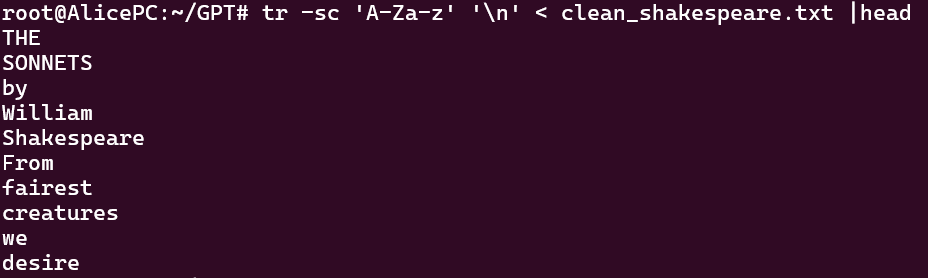
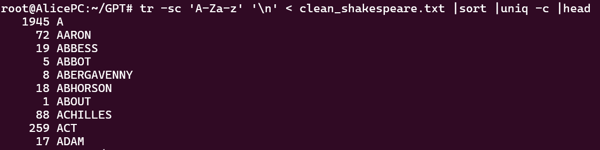

# Building GPT from Scratch: Course Report

## Introduction (?)

## Milestone 0 : Simple Tokenization with Unix
In Natural Language Processing (NLP), one first step is to tokenize a given text into different tokens. These tokens then serve as a basis for the vocabulary and other processes. 
Tokenization can be more or less sophisticated. A very simple way is to just remove punctuation and use spaces as an indicator for separation of tokens. 
This can easily be achieved by using different Unix commands, as demonstrated in the following. 
```bash
tr -sc 'A-Za-z' '\n' < corpora/clean_shakespeare.txt |head
```
With this line, everything that is not an uppercase or lowercase letter (identified via `-c` meaning complement) is squeezed together (via the flag `s`) and substituted by a new line, resulting in the following output:

To sort the output by alphabet, the command can be easily extended by a `sort` pipe: 
```bash
tr -sc 'A-Za-z' '\n' < corpora/clean_shakespeare.txt |sort |head
```

To get a better overview, the pipeline below can be used to only show unique tokens with their corresponding absolute frequencies.
It is important to sort before applying `uniq`, since this command only counts consecutive lines.
````bash
tr -sc 'A-Za-z' '\n' < corpora/clean_shakespeare.txt |sort |uniq -c |head
````
Executing that line, gives you this output:



To gain a better understanding of the given corpus, the unique characters can again be sorted by occurrence, applying again a ``sort`` operation.
This time, we need to specify ``-n``, to sort numerically (by the number of occurrence) and `-r`, meaning reverse ordering, so starting with the token that occurs the most. 
````bash
tr -sc 'A-Za-z' '\n' < corpora/clean_shakespeare.txt |sort |uniq -c |sort -n -r |head
````
This pipeline results in the following output:


From this, we can identify two problems.
First, as we can see for the token "I", we still have a mixture of uppercase and lowercase letters, while we aim to have a case-insensitive tokenization.
This is easily fixed by adjusting the pipeline to merge upper- and lowercase letters.
````bash
tr 'A-Z' 'a-z' < clean_shakespeare.txt | tr -sc 'A-Za-z' '\n' | sort | uniq -c | sort -nr | head
````
Here we can see, that the problem is now solved:

Second, the last line of the head is just the character "d", resulting from the mere removal of punctuation. 
Contractions like "I'd" will lead to "d" being perceived as a single token. By that, it is showcased how primitive this way of tokenization is.
For more complex models, more sophisticated algorithms, like Byte-Pair Encoding, should be used for this step to ensure better performance.

## Milestone 1: Byte-Pair Encoding

The Byte Pair Encoding Milestone is composed of the following parts:

* getting unique characters from the corpus
* applying our BPE function 
* checking for accuracy
* comparing byte pairs from our encoding to another model's encoding
* evaluating a different corpora's accuracy with our an a diffent model's byte pair encoding 

### Getting unique characters from the corpus
We retreive all unique characters from the corpus by applying our get_words function, which uses a regular expression tokenizer
that also counts the occurence of each character and saves this into a dictionary.

### Applying our BPE function
We then utilize our self written BPE function, that takes the corpus text as well as the dictionary of vocabulary 
and a certain number of k merges. The BPE function searches for the most common occurence of a token following another and then merges these tokens into a new token and appends the new token to the vocabulary. It returns the new vocabulary after k merges, a sorten token frequency and a dictionary matrix. In order to get the best three merges, we applied the BPE function with 1 to 2001 merges in steps of 100 to our training set, created a uni-, a bi- a tri- and a fourgram for each k and evaluated their perplexity, then saved the k and the kind of n-gram for the top three best perplexities. Furthermore we used those top three best merges to split our training, validation and test corpus into byte pairs using our to_byte_pair function that applies the vocabulary retrieved from the BPE function and splits the corpus accordingly. 

### Checking for Accuracy


## Milestone 2: A Simple N-Gram

## Milestone 3: The Neural N-Gram

The Neural N-Gram is composed of the following parts: 

* embedding
* forward pass
* backward pass
* optimizer
* generate fuction

In training a step through the network functions as follows: 

First the training function is called which is passed the number of training steps, as well as after how many steps the training progress should be evaluated. For every step we sample a batch of inputs and targets from the trokenized training version of the shakespeare corpus. With these the forward step is called

#### The forward pass
The goal of the forward pass within training is to quantify the current performance of the embedding. Within the neuronal network, the embedding are the weights (of size vocab_size x vocab_size). From a higher-level perspective however, the embedding is a bigram word-cooccurance matrix that is modifed based on the input examples in traing. For this, the input is first reshaped into logits, changing their shape from batch, seq_len to batch, seq_len, vocab_size. Then we calculate and retrun both the logits and the softmaxed corssentropy loss between the input and the target. 

#### The backward pass
Now that we have quantified the performance we have to modify the weights accordingly. For this we have to calculate the gradient. Luckly for us the gradient through the softmaxed crossentropy is just the softmaxed input minus the one-hot encoding of the targets. To then apply the errorsignal only to the relevant weights we matrix mutliply them with the transposed one-hot-encoding of the original input. 

 #### The optimizer
For the optimizer we use the the torch version of Adam, which is passed the gradients we calculated in the backward step. For this to work, we had to convert the embedding table into a torch tensor.

#### The training
To improve the efficency of the training we added some additional steps: 

#### Early stopping
Early stopping is a common partice to prevent overfitting and make sure the model is continously improving during the training process. For this, when building the corpus we spit it into two parts the training corpus 90% an the validation corpus 10%. During the training we collect the loss. Aver a predetimed number of steps (validation_steps) we average the loss on the training set and compare it to how the performance of the model on 1/10*validation_step iterations on the validation set. If the performance decreases on patience iterations of the validation dataset the training is terminated. 

#### Saving the model
As the model-parameters are contained within the embedding matrix the model can be easily saved and realoded. We automated this as follows: Whenever the file n_grams contains less than k (k=5) entries or if the performance of the current model is better than the worst performing model in the folder, the weights are saved.

#### Generation
The saved embeddings can then in turn be loaded and used to generate text. For this, a starting character and the desired text-length is passed to the generate function of the model. Tbe function then interativly retreivs the embedding for the current token in the sequence and using a multinomial function samples the following word from it. As the tokes are index numbers at this stakes they are run through a decoding function to convert them into strings. 

#### Parameter
There are a decent number of parameters and hyperparameters involved in the model, namely: 
* training_steps (how long the model should be trained)
* validation_steps (after how many steps the performance of the model should be checked)
* patience (after how many checks with no imporvemnt the training should be cancled)
* training loss, validation loss - the perfromance of the model on the training / validation set 
* perplexity
The infuence of them will be explored further in the following. 


## Milestone 4: A Simple GPT Model


